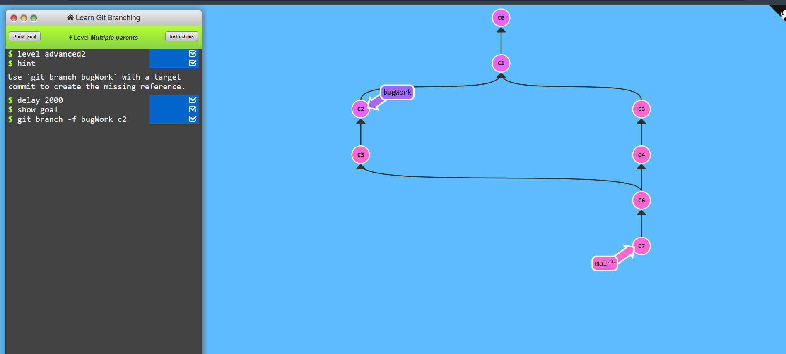

# Learning Git branching

# Advanced Topic

## Level - 1 : Rebasing over 9000 times

```
git rebase main bugFix
git rebase bugFix side
git rebase side another
git rebase another main
```


## Level - 2 : Multiple Parents

```
git branch -f bugWork c2
```



## Level - 3 : Branch Spaghetti

```
git checkout one
git cherry-pick c4 c3 c2
git checkout two
git cherry-pick c5 c4 c3 c2
git checkout three
git merge c2
```

