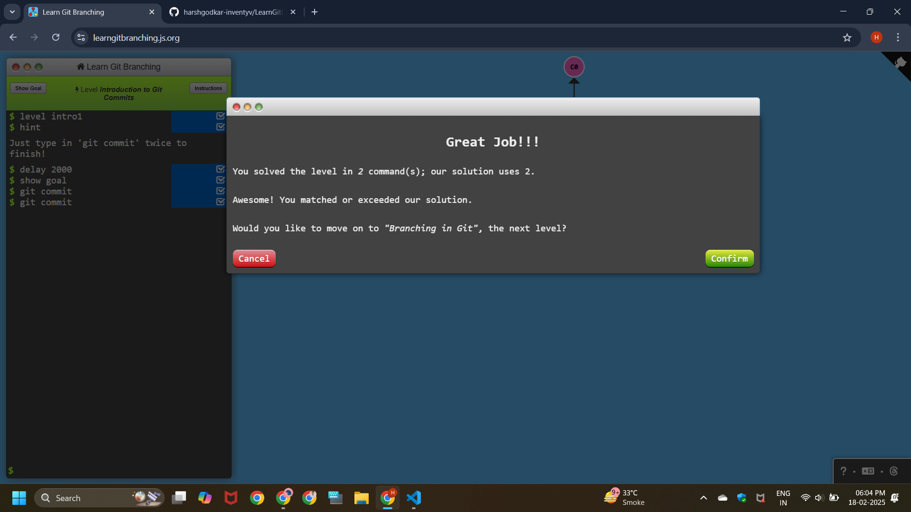
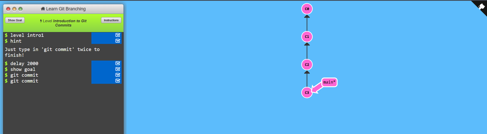
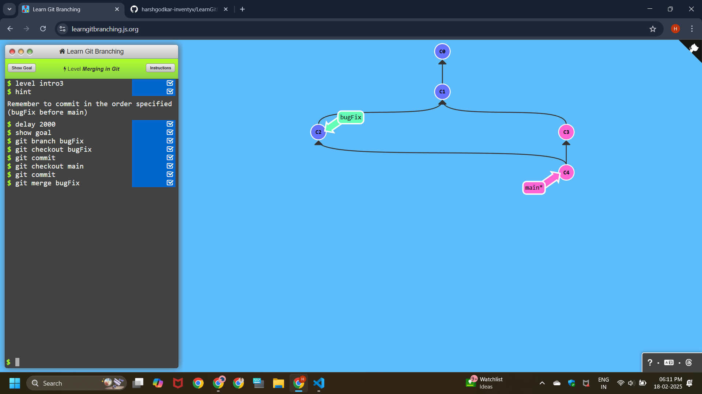
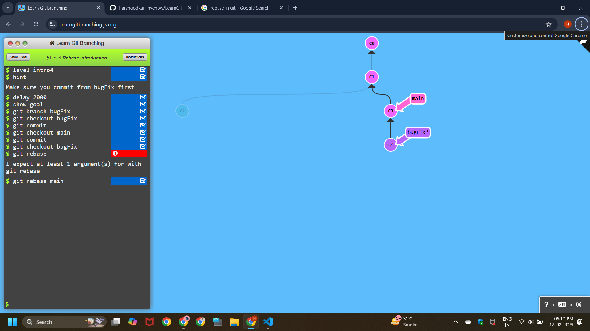

# Learning Git branching

# Introduction Sequence

## Level - 1 : Intoduction to Git Commits

```
git commit
git commit
```



## Level - 2 : Branching in Git

```
git branch bugFix
git checkout bugFix
```


## Level - 3 : Merging in Git

```
git checkout -b bugFix
git commit
git checkout main
git commit
git merge bugFix
```




## Level - 4 : Rebase Introduction

```
git checkout -b bugFix
git commit
git checkout main
git commit
git checkout bugFix
git rebase main
```

