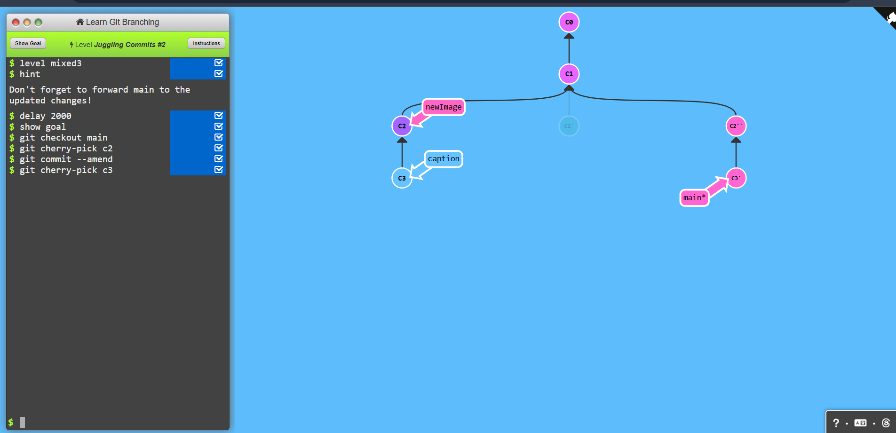
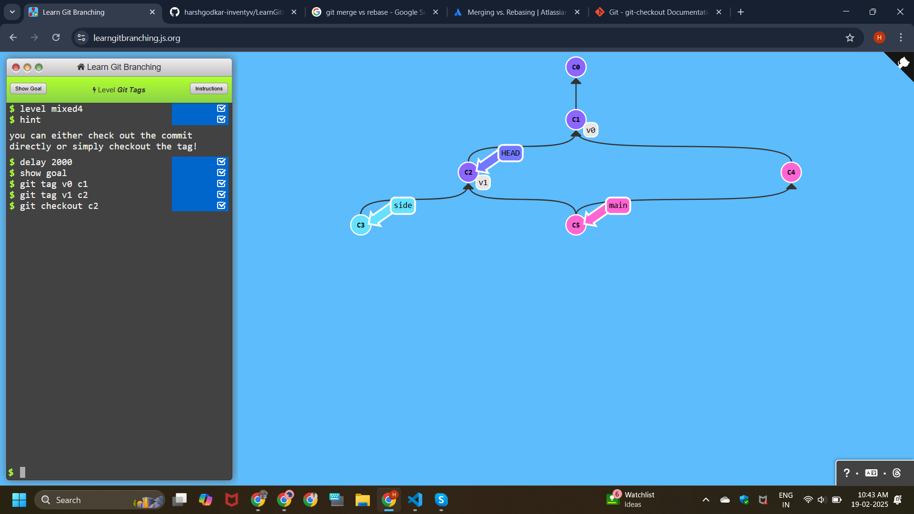
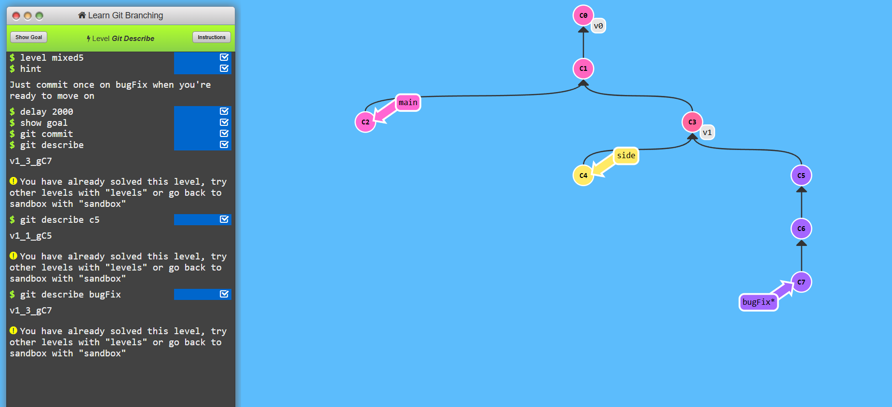

# Learning Git branching

# A Mixed Bag

## Level - 1 : Grabbing Just 1 commit

```
git checkout main
git cherry-pick c4
```


## Level - 2 : Juggling Commits

```
git rebase -i HEAD~2 (order changed)
git commit --amend
git rebase -i HEAD~2 (order changed)
```


## Level - 3 : Juggling Commits2

```
git checkout main
git cherry-pick c2
git commit --amend
git cherry-pick c3
```




## Level - 4 : Git Tags

```
git tag v0 c1
git tag v1 c2
git checkout c2
```




## Level - 5 : Git Describe

```
git commit
git describe
v1_3_gC7

git describe c5
v1_1_gC5

git describe bugFix
v1_3_gC7
```


