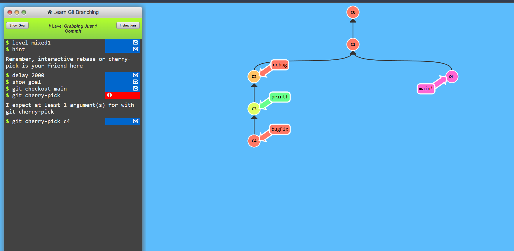
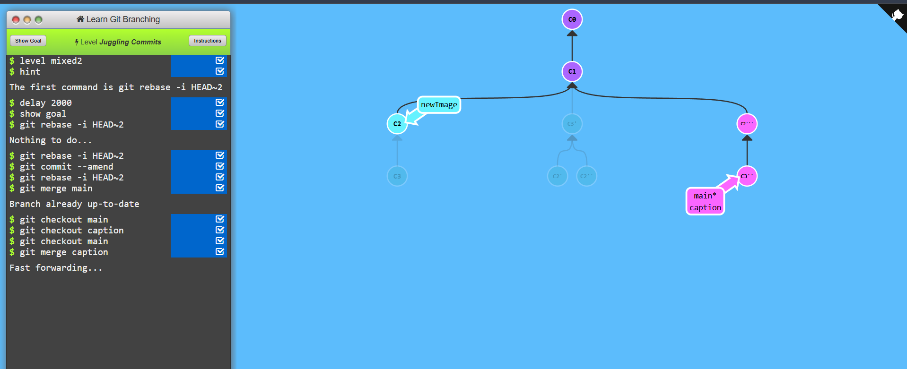

# Learning Git branching

# A Mixed Bag

## Level - 1

```
git checkout main
git cherry-pick c4
```


## Level - 2

```
git rebase -i HEAD~2 (order changed)
git commit --amend
git rebase -i HEAD~2 (order changed)
```

