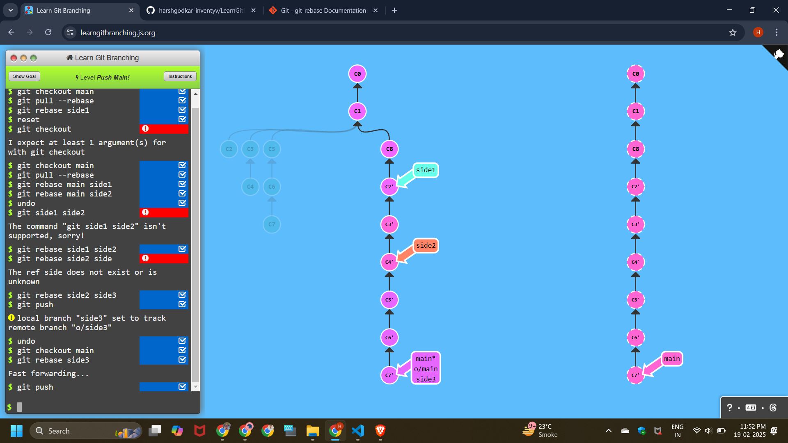

# Learn Git Branching


# To Origin And Beyond -- Advanced Git Remotes!

## Level - 1 : Push main

```
git checkout main
git pull --rebase
git rebase main side1   
git rebase side1 side2
git rebase side2 side3
git checkout main
git rebase side3
git push
```




## Level - 2 : Merging with remotes

```
git checkout main
git pull
git merge side1
git merge side2
git merge side3
git push
```


## Level - 3 : Remote Tracking

```
git checkout -b side
git commit
git branch -u o/main
local branch "side" set to track remote branch "o/main"
git pull --rebase
git push
```


## Level - 4 : Git Push Arguments

```
git push origin main
git push origin foo
```


## Level - 5 : Git Push Arguments#2

```
git push origin main^:foo
git push origin foo:main
```


## Level - 6 : Fetch Arguments 

```
git fetch origin C6:main
git fetch origin C3:foo
git checkout foo
git merge main
```


## Level - 7 : Source of nothing

```
git push origin :foo
git fetch origin :bar
```


## Level - 8 : Pull Arguments

```
git pull origin c3:foo
git pull origin c2:side
```

