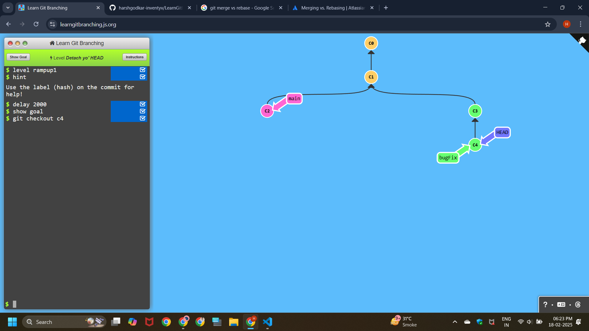
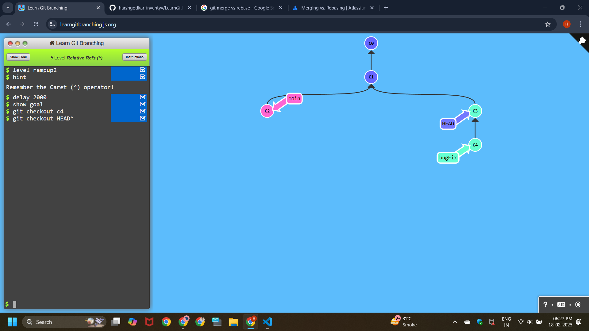
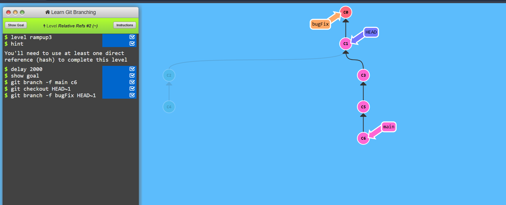
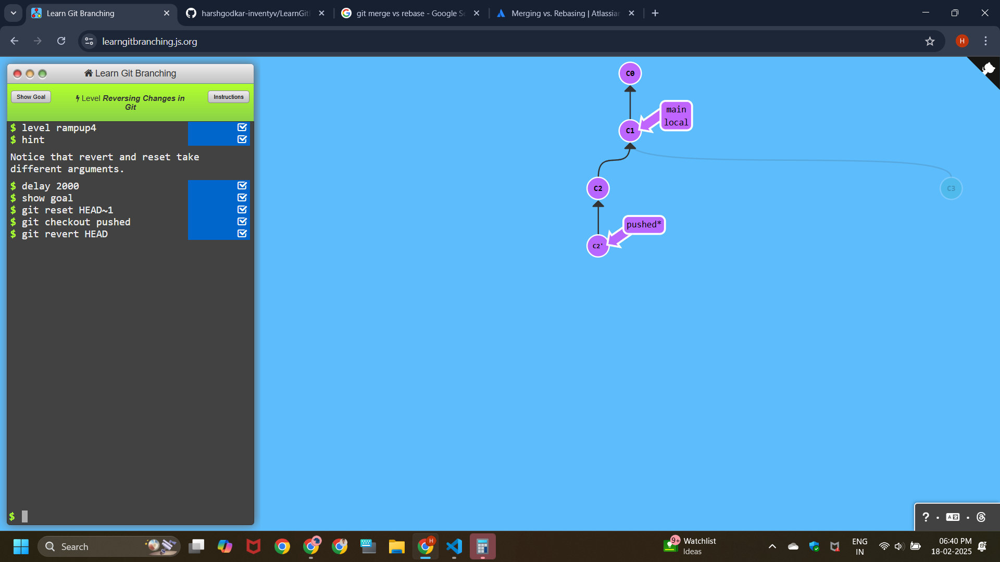

# Learning Git branching

# Ramping Up

## Level - 1

```
git checkout c4
```




## Level - 2

```
git checkout c3
```




## Level - 3
```
git branch -f main c6
git checkout HEAD~1
git branch -f bugFix HEAD~1
```



## Level - 4

```
git reset HEAD~1
git checkout pushed
git revert HEAD
```
