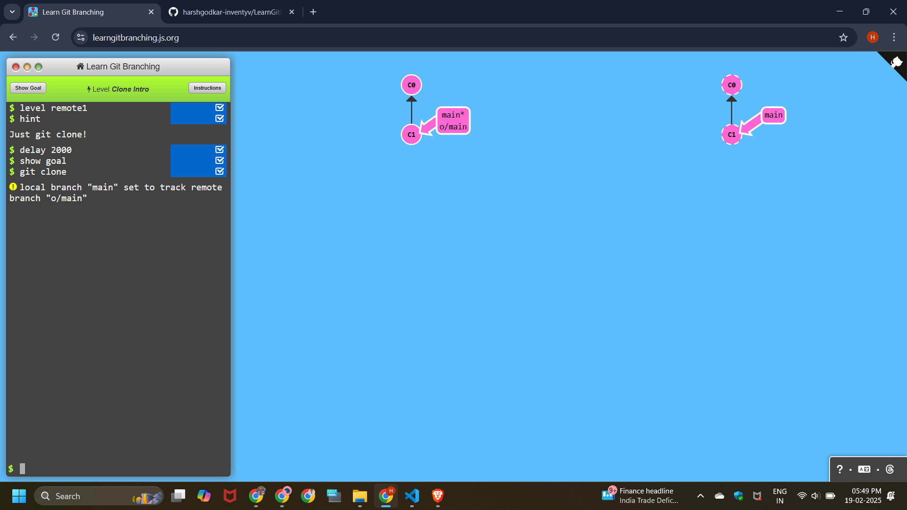
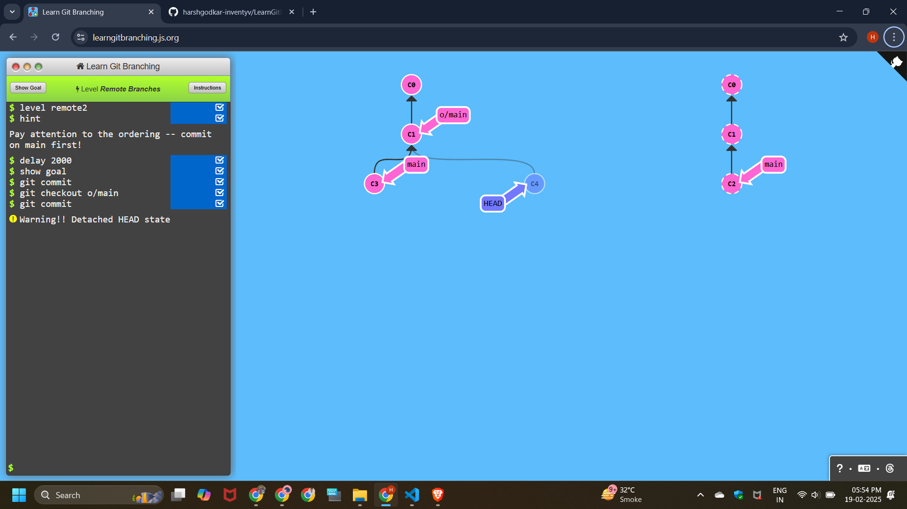
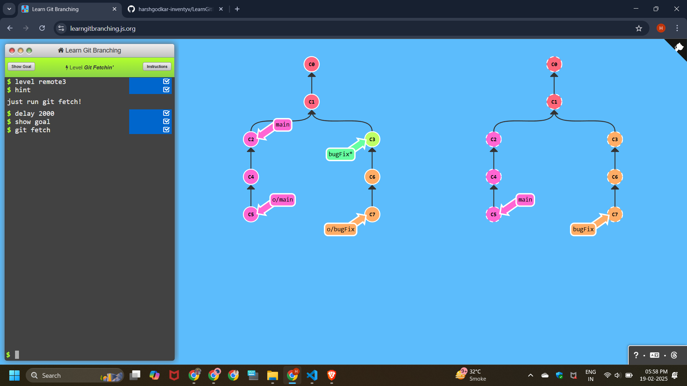
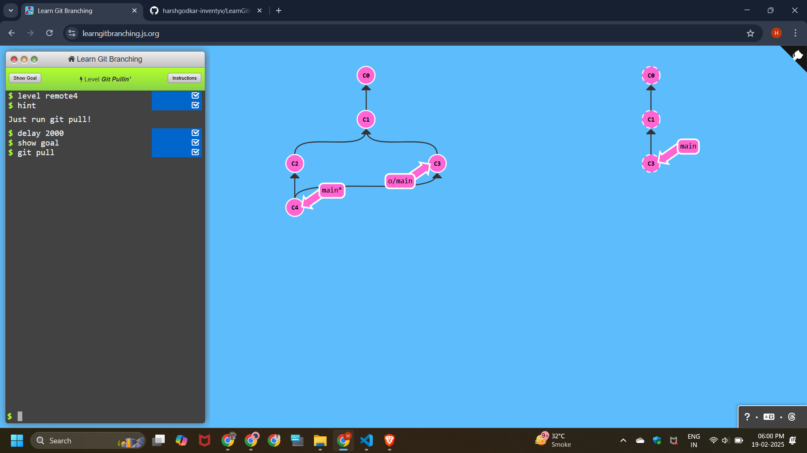

# Learn Git Branching


# Push & Pull -- Git Remotes!

## Level - 1 : Git Clone Intro

```
git clone
```



## Level - 2 : Remote Branches

```
git commit
git checkout o/main
git commit
```



## Level - 3 : Git Fettin'

```
git fetch
```


## Level - 4 : Git pullin'

```
git pull
```



## Level - 5 : Faking TeamWork

```
git clone
git fakeTeamwork main 2
git commit
git pull
```


## Level - 6 : Git Pushin'

```
git commit
git commit
git push
```


## Level - 7 : Diverged History

```
git clone
git fakeTeamwork
git commit
git pull --rebase
git push
```


## Level - 8 : Locked Main

```
git checkout -b feature
git branch -f main c1
git push

